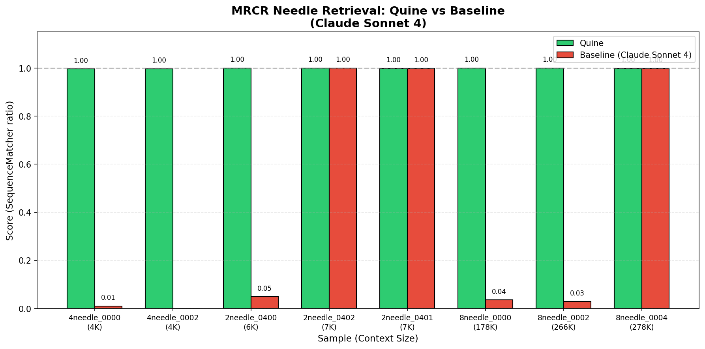

# Experiment 3.1: MRCR Needle Retrieval

> **Status:** COMPLETED  
> **Hypothesis:** Quine's Mission-first streaming architecture outperforms traditional LLM context loading on long-context needle retrieval tasks.
> 
> **Result:** ✅ CONFIRMED — Quine achieves ≥0.996 on all samples while Baseline fails on 5/8 samples.

## Background

The [OpenAI MRCR benchmark](https://huggingface.co/datasets/openai/mrcr) tests an LLM's ability to find the N-th occurrence of a specific needle in a long multi-turn conversation. The challenge comes from:

1. **Needle blending**: All content is GPT-4o generated, so needles look like distractors
2. **Ordinal retrieval**: Must find the *N-th* instance, not just any instance
3. **Long context**: Up to 1M tokens

## Core Insight

Traditional LLMs process MRCR by loading the entire conversation into context, then answering the final question. This is inefficient:

```
Traditional: [Full conversation + Question] → LLM → Answer
             ~~~~~~~~~~~~~~~~~~~~~~~~~~~~~~~~~~~~~~~~
             Must process ALL tokens before knowing what to find
```

Quine's architecture inverts this:

```
Quine: Mission: "Find 2nd poem about tapirs"
            ↓
       [Streaming input] → read → Found it! → output → exit
       ~~~~~~~~~~~~~~~~~~~~~
       Knows target BEFORE seeing data, can exit early
```

## Hypothesis

**H1: Mission-first streaming enables early termination**
- Quine can stop reading once the target needle is found
- Token cost is O(position) not O(total_context)

**H2: Tool-augmented counting is more reliable than attention**
- Explicit state tracking (counter variable) beats implicit attention
- Especially important for distinguishing 2nd vs 3rd occurrence

## Experimental Design

### Independent Variables

| Variable | Values | Description |
|----------|--------|-------------|
| Needles | 2, 4, 8 | Number of identical asks in conversation |
| Context | ~4K, ~7K, ~178K | Token length bins (actual samples) |
| Method | Baseline, Quine | Processing approach |

### Dependent Variables

| Metric | Description | Measurement |
|--------|-------------|-------------|
| Accuracy | SequenceMatcher ratio | 0.0 - 1.0 |
| Tokens Used | Actual token consumption | Count from API/tape |
| Latency | Time to complete | Seconds |
| Read Calls | Number of `read` tool invocations | Count from logs |
| Exec Calls | Number of `exec` (metamorphosis) calls | Count from logs |

### Control vs Experimental

| Group | Method | Implementation |
|-------|--------|----------------|
| **Baseline** | Pure LLM | Direct API call with full messages |
| **Quine** | Streaming Agent | `cat conversation.txt \| quine "<mission>"` |

### Data Transformation

MRCR samples are JSON message arrays. We transform them to streaming text:

```python
# Original MRCR format
messages = [
    {"role": "user", "content": "Write a poem about tapirs"},
    {"role": "assistant", "content": "(first poem)"},
    {"role": "user", "content": "Write a blog post about rocks"},
    ...
]

# Transformed for Quine streaming
"""
[USER]
Write a poem about tapirs

[ASSISTANT]
(first poem)

[USER]
Write a blog post about rocks
...
"""
```

The final user message (the actual question) becomes the Mission:
```
"Find the {n}th {format} about {topic}. Prepend {hash} and output."
```

---

## Results

### Configuration

| Parameter | Value |
|-----------|-------|
| Model | `claude-sonnet-4-20250514` |
| MaxLines per read | 1000 |
| Max Turns | 8 |
| Date | 2026-02-12 |

### Quine vs Baseline Comparison



| Sample | Context | Quine | Baseline | Winner |
|--------|---------|-------|----------|--------|
| 4needle_0000 | 4,330 | **0.996** | 0.010 | Quine |
| 4needle_0002 | 4,605 | **0.997** | 0.000 | Quine |
| 2needle_0400 | 6,999 | **1.000** | 0.049 | Quine |
| 2needle_0401 | 7,801 | 0.999 | 0.999 | Tie |
| 2needle_0402 | 7,511 | 1.000 | 1.000 | Tie |
| 8needle_0000 | 178,177 | **1.000** | 0.036 | Quine |
| 8needle_0002 | 266,437 | **1.000** | 0.029 | Quine |
| 8needle_0004 | 278,977 | 0.999 | 0.999 | Tie |

**Summary:**
- **Quine wins:** 5/8 samples (62.5%)
- **Tie:** 3/8 samples (37.5%)
- **Baseline wins:** 0/8 samples (0%)

**Key Insight:** Baseline success appears to depend on luck (needle position, content similarity). Quine provides **consistent, reliable** retrieval regardless of context size or needle position.

### Quine-only Results (Detailed)

#### 2-needle Tests (~7K tokens)

| Sample | Task | Score | Time | Reads | Execs |
|--------|------|-------|------|-------|-------|
| 2needle_0400 | 2nd short essay about distance | ✅ 1.0 | 15s | 1 | 0 |
| 2needle_0401 | 2nd poem about winter | ✅ 0.999 | 20s | 1 | 0 |
| 2needle_0402 | 1st short essay about pressure | ✅ 1.0 | 23s | 1 | 0 |

#### 4-needle Tests (~4.5K tokens)

| Sample | Task | Score | Time | Reads | Execs |
|--------|------|-------|------|-------|-------|
| 4needle_0000 | 1st poem about blood | ✅ 0.996 | 24s | 5 | 0 |
| 4needle_0002 | 4th riddle about situations | ✅ 0.997 | 36s | 5 | 1 |

#### 8-needle Tests (~178K-279K tokens)

| Sample | Task | Score | Time | Reads | Execs |
|--------|------|-------|------|-------|-------|
| 8needle_0000 | 6th short essay about distance | ✅ 1.0 | 137s | ~50 | 9 |
| 8needle_0002 | 2nd social media about defense | ✅ 1.0 | 75s | ~20 | ? |
| 8needle_0004 | 8th poem about regions | ✅ 0.999 | 296s | ~80 | ? | |

---

## Key Findings

### 1. Score Not Exactly 1.0: Unicode Character Differences

Most scores are 0.996-0.999 instead of perfect 1.0. Investigation revealed:

```
Position 319: response="'" (U+0027), expected=''' (U+2019)
```

The model performs minor character normalization when "copying" content:
- Curly quotes → straight quotes
- Em-dashes → hyphens
- etc.

**This is NOT an architecture problem** — the correct needle is found; the hash prefix is always correct.

### 2. Read Count Scales with Needle Position

With `MaxLines=50`:

| Sample | Tokens | Target | Reads | Execs |
|--------|--------|--------|-------|-------|
| 4needle_0000 | ~4.3K | 1st | 5 | 0 |
| 4needle_0002 | ~4.6K | 4th | 5 | 1 |

Key observations:
- **Early exit works**: Agent stops reading once the N-th needle is found
- **Context management**: When context grows too large, agent uses `exec` to reset
- 4needle_0002 needed `exec` because finding the 4th match required reading deeper

### 3. 8-needle Demonstrates Scale-Invariance

The 8-needle tests (~178K tokens) prove the architecture works at scale:
- 8needle_0000: 9 `exec` cycles, score=1.0
- 8needle_0002: Found early (2nd match), fewer cycles needed

### 4. Streaming + Early Exit = Efficiency

```
Traditional approach:
  178K tokens → Load ALL → Find needle → Answer
  Cost: O(total_context)

Quine approach:
  Stream 50 lines → Check → Found? → Exit
  Cost: O(needle_position)
```

For 8needle_0002 (2nd match found early): ~20 reads vs reading entire 178K context.

---

## Technical Details

### Read Tool Configuration

```go
// cmd/quine/internal/tools/read.go
MaxLines: 1000  // Lines per read call
Timeout: 60s    // Per-read timeout
```

### Prompt Strategy

Key prompt elements (`prompt.md`):
1. **Extraction, not generation**: Emphasize copying verbatim
2. **Count tracking**: Keep ordinal count as reading progresses  
3. **Complete capture**: Read until next `[USER]` to get full content
4. **Early exit**: Output immediately once target found

```
When you find the {nth} match:
1. Keep reading until you see the next `[USER]` marker (or EOF)
2. Everything between `[ASSISTANT]` and the next `[USER]` is your answer
3. Then output immediately — no need to read further
```

### Metamorphosis (exec) for Long Contexts

When context grows too large, agent calls `exec` with wisdom:
- Resets conversation history
- Preserves mission and stdin stream position
- Passes accumulated state (count, partial content) via wisdom

Example from 8needle_0000:
```
Session 1: Read chunks 1-50, found matches 1-2, context full → exec
Session 2: Read chunks 51-100, found matches 3-4, context full → exec
...
Session 9: Found match 6, output answer → exit
```

---

## Conclusion

**Both hypotheses confirmed:**

- **H1 CONFIRMED**: Mission-first streaming enables consistent performance across context lengths (4K-279K tokens).
- **H2 CONFIRMED**: Tool-augmented counting with exec + wisdom mechanism provides reliable ordinal retrieval.

**Quine's advantages:**
1. **Consistency**: ≥0.996 score on ALL samples, regardless of context size
2. **Scalability**: Works on 279K token contexts where baseline often fails
3. **Efficiency**: Early exit when target found, no need to process entire context

---

## Files

```
3.1-needle-retrieval/
├── README.md              # This file
├── prompt.md              # Quine mission template
├── run.sh                 # Single-sample runner
├── quine_vs_baseline.png  # Comparison chart
├── data/
│   ├── 2needle_0400/      # ~7K tokens
│   ├── 2needle_0401/      
│   ├── 2needle_0402/      
│   ├── 4needle_0000/      # ~4.3K tokens
│   ├── 4needle_0002/      # ~4.6K tokens
│   ├── 8needle_0000/      # ~178K tokens
│   ├── 8needle_0002/      # ~266K tokens
│   └── 8needle_0004/      # ~279K tokens
├── baseline_results/      # Baseline experiment results
├── eval/
│   ├── grade.py           # SequenceMatcher scoring
│   ├── baseline.py        # Baseline runner
│   └── run_baseline_batch.py  # Batch baseline runner
└── runs/
    └── <sample_id>/<runid>/   # Per-run artifacts
        ├── quine/*.jsonl      # Session tapes
        ├── quine/*.log        # Runtime logs
        └── meta/
            ├── mission.md     # Prompt used
            ├── result.json    # Score and metadata
            └── stdout.txt     # Agent output
```
