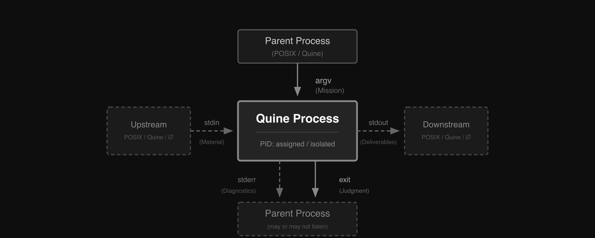

# Harness Engineering Is Architectural Amnesia
> *Stop rebuilding the operating system in user space.*

The AI industry has finally noticed that runtime matters.

Good. That means it has finally found the right problem.

Then it made a deeply mistaken move: it decided to turn runtime into a user-space methodology and call the result "Harness Engineering."

Look closely at today's agent frameworks and the pattern is obvious. State, scheduling, retries, supervision, communication, recovery—piece by piece, they are reconstructing a narrower, weaker, proprietary shadow of the operating system.

This is not a breakthrough. It is architectural amnesia.

**Agent runtime belongs in the OS layer**

## Right Problem, Wrong Layer

The current harness-engineering discourse is reacting to a **real engineering problem**. A raw model, or even a simple tool-calling loop, is not enough. Long-running agents need persistence, tool governance, failure recovery, delegation, observability, and human control. They need a runtime.

By now the term is coherent enough to name plainly. **"Harness Engineering"** means building that environment around the model: planning surfaces, memory compaction, tool interfaces, execution sandboxes, approval gates, evals, traces, architectural constraints, and recovery loops.

And that is the **core mistake**. Once you describe the harness honestly, you are already describing runtime. The more seriously you take harness engineering, the more you start rebuilding the operating system in user space.

These are not bad ideas. They are what smart engineers invent when **the substrate is missing**: planning becomes user-space lifecycle management; state becomes ad hoc storage; observability becomes framework-specific tracing; failure handling becomes a weaker imitation of signals and exit semantics.

The irony is that the best harness engineers keep rediscovering that **Unix philosophy works**. They cite the same lessons constantly: small composable units, explicit failure signals, text as universal interface. But they treat those lessons as design inspiration rather than recognizing that Unix itself is the physics. The primitives do not need to be reimagined at a higher layer. They need to be inherited from the layer that already has them.

The result is an old architecture rebuilt at a worse layer.

And that **mistake is expensive**. Build your substrate in user space and you give up decades of hardened edge-case handling. You replace standard contracts with framework-specific schemas. You cut yourself off from the tooling ecosystem that already knows how to inspect, supervise, compose, and debug OS-native processes.

**Any sufficiently ambitious harness engineering effort contains an ad hoc, informally specified, bug-ridden, slow implementation of half of POSIX.**

## The Runtime Already Exists

If agent systems need execution, memory isolation, communication, supervision, and judgment, there is a very boring question worth asking: what already does that well?

The answer is the **operating system**.

The mapping is almost embarrassingly direct:

- Agent instance -> process
- Working context -> process memory + filesystem
- Communication -> stdin / stdout / stderr / pipes
- Supervision -> signals, schedulers, resource limits
- Delegation -> process tree

This mapping is not a metaphor; it is a direct structural fit. The operating system is already the most battle-tested runtime substrate on the planet. Rebuild these primitives in user space and you throw away fifty years of debugging, scheduling, isolation, and failure handling.

Models have also seen shells, files, logs, stack traces, exit codes, and text streams everywhere. That does not make sh magically optimal for every task. It does mean OS-native interfaces begin with a stronger prior than orchestration schemas we invented last quarter.

**Agent frameworks call this infrastructure. The OS calls it Tuesday.**

---

## Quine: This Has Been Built

> Quine is not here as a product pitch. It is here because I built the runtime this essay is arguing for.

This essay makes a concrete claim: agent runtime belongs in the OS. Quine matters because it is the existence proof: a POSIX process I built to absorb agent-runtime semantics directly, without inventing a translation layer.

The point is not that Quine is uniquely useful. The point is that once the agent is treated as a process, ordinary OS primitives stop looking like analogies and start doing literal runtime work.

Quine is a user-space process that refuses to rebuild the operating system above itself.

### Start With A Real Process

Start with the smallest possible thing: a process that actually behaves like a process.

```sh
$ cat article.txt | ./quine "Summarize the main themes"
# exit code: 0
# stdout: "the article is about..."
# stderr: ""
```

Mission enters through `argv`. Material enters through `stdin`. Deliverables exit through `stdout`. Diagnostics stay on `stderr`. Success or failure is an exit code.

A Quine process does one cognitive step, then exits. Unix builds filters, not monoliths. At the shell boundary, Quine is just a POSIX text filter: it reads text, transforms it, writes text, and exits with judgment. It does not invent a protocol. It inherits one. The channels are the file descriptors.

That matters because text filters compose by default. Cleanliness is not the point. Composition is.



### Composition Is Default

Pipes and exit codes are not Quine features — they are OS features that Quine simply obeys:

```sh
$ ./quine "Validate this config" < config.yaml && deploy.sh
$ ./quine "Try approach A" || ./quine "Try approach B"
```

In most frameworks, composition is a product feature. In Unix, it is the default grammar of the environment. No framework glue. No proprietary graph definition. The shell already knows how to compose processes, route data, and branch on judgment.

The shell is not a prototype of orchestration. It is the original orchestration layer.

### Delegation Preserves The Contract

Once composition is native, delegation stops looking exotic too:

```sh
# outside quine
$ ./quine "analysis and fix the code"
# inside quine
...
turn: sh(command="./quine 'fix the foo error in foo.py'")
```

Quine does not spawn a special worker class or hidden runtime actor. It uses real process primitives:

- `fork` spawns child processes with new PIDs, inherited constraints, and cloned starting state
- `exec` replaces the current process while preserving mission and resetting context
- `exit` terminates with success or failure, and the OS propagates that judgment

The task tree becomes a real process tree. Scheduling, cleanup, signal forwarding, and resource accounting are inherited from the OS. Delegation does not create a second kind of runtime object; parent, child, and subtree all expose the same contract: `argv`, `stdin`, `stdout`, `stderr`, exit code.

No new runtime. No custom scheduler. No proprietary protocol. The operating system is doing what it was built to do.

### The Control Loop Is Isomorphic

And that is the broader control story. Harnesses are trying to close a feedback loop around a stochastic generator: preserve state, observe behavior, detect drift, and intervene. Those are already OS-shaped problems. Files externalize state. Logs and streams expose behavior. Exit codes and signals make failure legible. Supervisors, schedulers, and permissions turn open-ended generation into a controllable process.

---

## POSIX Is Only The First Step

This post makes one bounded claim: agent runtime belongs in the OS. Rebuilding that runtime in user space is a mistake.

Quine's own architecture, the consequences of that mapping, and the more interesting observations it unlocks belong to the essays that follow.

And if you pull that thread far enough, POSIX is only the first step. There is a stranger horizon beyond Unix. The hint, **Plan 9**.

The rest belongs to later essays. Follow along at [kehao95.substack.com](https://kehao95.substack.com/) and [x.com/kehao95](https://x.com/kehao95). Quine is open source at [github.com/kehao95/quine](https://github.com/kehao95/quine).

The runtime is the OS. The series continues.


## References

- OpenAI, ["Harness engineering: leveraging Codex in an agent-first world"](https://openai.com/index/harness-engineering/). February 11, 2026.
- Anthropic, ["Effective harnesses for long-running agents"](https://www.anthropic.com/engineering/effective-harnesses-for-long-running-agents). November 26, 2025.
- Random Labs, ["Slate: moving beyond ReAct and RLM"](https://randomlabs.ai/blog/slate).
- LangChain, ["Improving Deep Agents with harness engineering"](https://blog.langchain.com/improving-deep-agents-with-harness-engineering/). February 17, 2026.
- Manus, ["Context Engineering for AI Agents: Lessons from Building Manus"](https://manus.im/blog/Context-Engineering-for-AI-Agents-Lessons-from-Building-Manus).
- Cognition, ["Don’t Build Multi-Agents"](https://cognition.ai/blog/dont-build-multi-agents).
- Martin Fowler, ["Harness Engineering"](https://martinfowler.com/articles/exploring-gen-ai/harness-engineering.html). February 17, 2026.
- X, ["Harness Engineering Is Cybernetics"](https://x.com/odysseus0z/status/2030416758138634583), post by @odysseus0z.
