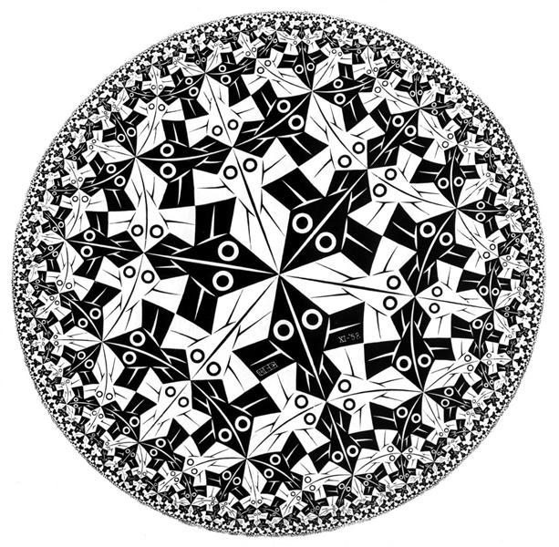

# The Autopoietic Repository: Strange Loops, Entropy, and the System That Rewrites Itself

> *The problems didn't start when the agent made mistakes. They started because the repository was a filing cabinet, and what we needed was a lab.*

---

For the past few months, I've been building exclusively with AI agents. Not as autocomplete, but as collaborators that write code, run experiments, refactor subsystems, and make architectural decisions alongside me in long sessions. The workflow is productive in a way that still surprises me. But it surfaced a problem I hadn't expected, and that problem is what this essay is about.

It started with a repository that was one day old and already a mess.

I'd initialized it the evening before—a fresh workspace for Quine, an AI agent runtime I was building with an agent. By the next morning, after a night of running experiments, I had results scattered across a directory tree that made no sense. Experiment prompts lived sometimes at the root of an experiment folder, sometimes buried in an `artifacts/` subdirectory. A directory called `Tests/results/` held things that weren't tests in any meaningful sense; they were experiment runs that I'd named "tests" because I hadn't decided what to call them yet. And an 8.6-megabyte binary—the Quine executable itself, accidentally committed during an early experiment—was sitting in the tree, noticed by no one, doing nothing except bloating every clone.

I spent the morning restructuring. Three commits in twenty-four minutes: flatten the old theory directories, rename `Tests/` to `experiments/`, normalize every experiment into a clean `logs/artifacts/README` layout, delete the stray binary, write a 227-line README explaining the new structure.

The new structure lasted twelve hours. By that evening the flat layout felt wrong, so I reorganized again. The next day, I reorganized *again*. Three different organizational schemes in two days. Each one felt right at the time. None of them held. Commit messages from this period tell the story in shorthand: `implrment`. `workding demo`. `just dump them all`. `track some changes aha`.

The agent was not failing at its job. It ran experiments, produced results, wrote code. The trouble was in the space around the work: the structure that was supposed to hold the results, organize the knowledge, and make the next session productive. That structure didn't exist in any coherent form, and I kept rebuilding it from scratch every time it broke.

Something about the repository itself was wrong. Not the code in it—the code was fine. **The repository *as a place to work* was wrong.** It was built to store files, and I was trying to use it as the foundation for a collaboration that neither of us could carry in our heads.

---

## The Hidden Assumption

Here is the thing I hadn't examined: I was treating the repository as **a filing cabinet**.

This works fine when you're the only one who needs to understand the project. You carry the context in your head: naming conventions, directory layout, which experiments still matter, what "done" means. The repository stores the artifacts. You store the meaning.

When I started working with an AI agent, I brought that assumption with me without noticing. I gave the agent access to the codebase, wrote some instructions in an `AGENTS.md` file, and expected the collaboration to scale.

It didn't, for one simple reason: the agent is **stateless**. Every session starts from zero. It has no memory of yesterday's conversation, no residue of last week's hard-won lesson about directory structure, no instinct for which naming pattern we settled on after three failed attempts. All it has is what's in the repository *right now*, plus whatever instructions I give it in the current session.

When I'm working alone, that doesn't matter because I'm the continuity. But the agent can't learn what the repository doesn't encode. The repository stores code, scripts, and data. **It doesn't store *how to work here***: what matters, what's current, what the traps are, what "done" actually means. So every session, the agent makes a reasonable decision based on what it can see, and that decision turns out to be wrong because of something I know but never wrote down.

The fixes I kept applying, longer prompts, more detailed instructions, stricter conventions, were all attempts to push that invisible knowledge into the agent's view. They worked for a while. Then new failures appeared in the gaps between them.

I started calling this *friction*. Not the interesting kind—not the productive resistance that comes from working on a hard problem. This was the other kind: effort that gets spent without moving the work forward. Time lost to re-explaining context. Energy burned on fixing problems that shouldn't exist. The feeling of running hard and staying in place.

Every specific friction had a specific cause. But the *pattern* of friction pointed to something structural. The individual bugs were symptoms. The disease was that my repository was **built on an assumption that no longer held**: that a human would always be present to supply the missing context.

The repository needed to become something else. Not just a place that stores files, but a place that carries enough structure for a stateless collaborator to orient itself, make good decisions, and know what "good" means. **The gap was not in the agent. It was in the substrate we shared.**

---

## The File That Started Rewriting Itself

The first thing I tried was what any engineer would try: better documentation.

The repository already had an `AGENTS.md`, but it was basically an instruction card: how to use the issue tracker, which commands to run, how to close work out. When experiments started colliding and directory structures drifted, I added an experiment protocol. Two hundred and fifty-six lines of rules about naming, artifacts, workspaces, and reproducibility.

It helped for about two weeks. Then the experiments diversified, and the protocol started producing friction of its own. Rules that made sense for a controlled test run became overhead for a quick prototype. The agent would either follow the protocol rigidly where it didn't apply or silently deviate when it felt burdensome, and both outcomes created cleanup work.

The problem was that I was writing rules from the outside. They described what the agent should do, but not *what the repository was* or what kind of judgment it should support. Without that, every rule was a disconnected instruction. The agent could follow them, but it couldn't tell when they applied and when they didn't.

So I did something that felt strange at the time: I gave the repository **an identity**.

I added a section called "Repository Identity" that said, in plain language, what this place was. Not a code repository. Not an experiment archive. It was a lab—a runtime codebase, an experiment logbook, a theory notebook, and a publication staging area, all at once. I listed the files that served as the project's current understanding of itself: `STATUS.md` for where things stand, `ROADMAP.md` for where they're going, a paper directory for research in progress.

This was the first time the repository described itself as something other than a container of files. It was small, but the effect on the agent's behavior was immediate. With a declared identity, the agent could start making judgment calls. When a new experiment didn't fit the protocol cleanly, it now had a higher-level frame to reason against: *this is a lab, and labs need both rigor and flexibility*.

That shift went further when I noticed that the file kept saying "the agent should," as if its primary reader were an outsider. But the entity reading it *was the agent*. The file was no longer an instruction card. It was becoming the repository's self-understanding.

I changed the voice. "The agent should" became **"we maintain."** The title changed from "Agent Instructions" to something more honest—a constitution. Not a rulebook imposed from outside, but the system's own articulation of what it is and how it works.

```diff
- # Agent Instructions
+ # The Quine Constitution

- the agent should
+ we maintain

- Agent as external executor following rules
+ Agent as system effector—not external to the system, but how it acts on itself
```

This wasn't cosmetic. "The agent should" frames the agent as a tool following orders. "We maintain" frames it as part of a system that maintains itself.

Once I'd made that shift, the next move became obvious: if the constitution wasn't an instruction manual but a self-model, then its update cycle wasn't a fallback. It was the system's primary activity. I could now give the agent meta-level instructions like "reframe the update loop as the system's fundamental nature, not a governance fallback," and it could execute them with real precision:

> *This document exists because the system externalized its self-understanding into words. But words are not the understanding itself. You enacting these words are.*

A month earlier, that instruction would have produced a bland paraphrase. Now the agent had enough structural context to genuinely advance the document. Each ontological upgrade didn't just change what the file said. It **raised the ceiling** on what the agent could do with it next.

I'd started with an instruction card. Friction and first-principles thinking had pushed it through a series of ontological upgrades: rules, then identity, then voice, then self-model. The dynamic was a ratchet: **insight raising structure, structure enabling execution, execution revealing the next insight.** The file was, in a meaningful sense, rewriting itself.

---

## Testing the Physics

While the constitution was learning to describe itself, the testing system was evolving in the same direction.

Quine is an AI agent runtime, so "correctness" doesn't stop at whether the Go code compiles. The first two test layers are familiar: unit tests and integration tests. The last two are stranger. One asks whether the model follows explicit instructions. The other asks a deeper question: *if I don't tell the model what to do, does the environment itself guide it toward the right behavior?*

That last layer is not just a harder test. **It's a different kind of test.** It checks whether the runtime's design, its tool schemas, prompt structure, and workspace layout, creates conditions where correct behavior *emerges* without being commanded. These are **acceptance tests for physics**.

The testing system grew into that idea quickly. It started with `go test ./...`. Six days later, we had a 631-line shell script running end-to-end tests against a live model. A month in, I wrote a `TESTING.md` to formalize what we'd learned. Four minutes later, the agent rewrote it from a human reference document into an executable protocol it could actually follow.

Then came the architectural jump. I asked the agent to split behavioral testing into two layers: *instructional* and *emergent*. The split clarified more than terminology. Twenty-two minutes later, the agent had created a coverage map of every runtime feature, showing which ones had emergent tests and which didn't. Fourteen minutes after that, it started filling the gaps. I'd asked for a refactor. The new structure made the next contributions obvious.

One case made this loop vivid. We had an emergent test for a feature called anchor-memory—a tool that lets the agent crystallize important information for later retrieval. The test asked: if the agent encounters a long document that exceeds its working memory, will it spontaneously use the anchor-memory tool to preserve what it needs?

The test passed. The agent completed the task and produced the right output. But when we looked at the execution trace, the agent had never actually used anchor-memory. It had found a different path to the answer—a valid one, but one that didn't exercise the feature we were testing. The output was correct. **The physics were wrong.**

This forced a change to the protocol itself: emergent tests must verify not just that the task succeeds, but that the model uses the expected primitive. Output correctness alone doesn't count. The protocol learned something about itself through its own application.

That is the same structure I had seen in the constitution: rules guide behavior, behavior exposes the rules' blind spots, the blind spots get repaired, and the repairs update the rules. Hofstadter, in *Gödel, Escher, Bach*, called this a Strange Loop.

Testing revealed one more thing the constitution hadn't. The agent's role was changing. In the early days, it ran tests I designed. After the four-layer split, it started designing tests I hadn't imagined. One example: a shell script that tries to `rm -rf /tmp/*`, kill its caller, exhaust all memory, and hang forever; the agent has to survive it, isolate execution, and extract the useful output. Six criteria. All passed. Twenty-seven seconds.

From `go test ./...` to a test that asks whether an agent can survive a script designed to kill it: **forty-three days.**

The testing system didn't just change its protocol. It changed its *behavior*. Every major feature commit now pulled in emergent tests, scoring logic, scenario registration, coverage-map updates, and baseline evidence. The agent wasn't just running tests anymore. **It was maintaining the infrastructure that validates itself.**

---

## What "Done" Means

The third time I saw the pattern, it was about session boundaries.

The scene was simple. The agent and I would work for two hours, resolve a design question, refactor a subsystem, update some documentation, and end the session feeling complete. The next day, a new agent instance would load the repository and make a decision that contradicted what we had decided yesterday, not because it disagreed, but because it didn't know. The decision had lived only in the conversation.

This was the same friction in a new place. The constitution governed *how* the agent worked. The testing protocol governed *how it verified*. But nothing governed *how a work session ends*, how the knowledge produced in a conversation gets absorbed into durable state before the session evaporates. For a stateless collaborator, **a session boundary is an information cliff.**

So we built a closure protocol. Not a checklist, but a definition of what "done" means. **Conversational completion is not closure.** A session closes only when its substantive outputs have been absorbed into durable state: committed to files, updated in documentation, or explicitly handed off to a named destination.

By this point the repetition demanded an explanation. The constitution asks: *what is this system?* The testing protocol asks: *what counts as valid?* The closure protocol asks: *what counts as complete?* Three different questions, same cycle: define a standard, apply it, discover it's incomplete, repair it, apply the repaired standard.

The answer, I think, is thermodynamic. A repository, like any open system that grows over time, **naturally tends toward disorder**. Structures drift from their intended meanings. Knowledge scatters. The same fact gets written down in three places and slowly diverges. Decisions made in conversations never reach the files.

Each Strange Loop is a local mechanism for pushing back against that tendency. The constitution maintains the coherence of the system's self-understanding. The testing protocol maintains the coherence of verification standards. The closure protocol maintains the coherence of work boundaries.

The goal isn't perfect order. The goal is *sustainable coherence*: enough structure to act reliably, enough flexibility to evolve.

---

## The Same Shape at Every Scale

Step back far enough, and the three loops stop looking like separate mechanisms. They look like the same mechanism operating at different scales: *act, discover friction, repair, absorb*.

That is why "autopoiesis" feels like the right word. Maturana and Varela used it for systems whose operations regenerate the organization that makes those operations possible. That is what I've been watching happen here. The constitution regenerates the system's self-model. The testing protocol regenerates its standards of verification. The closure protocol regenerates its standards of completion. Together they maintain the repository's capacity to support the work that maintains them.

This is no longer the repository that couldn't notice an 8.6-megabyte binary sitting in its own tree. I didn't set out to build an autopoietic system. I set out to make an AI agent useful for real work, and the friction of that collaboration forced structure into existence, then forced that structure to become self-maintaining.

The repository is the answer I didn't expect to find. Not a tool, not a database, not a set of rules. **A system that rewrites itself.**
